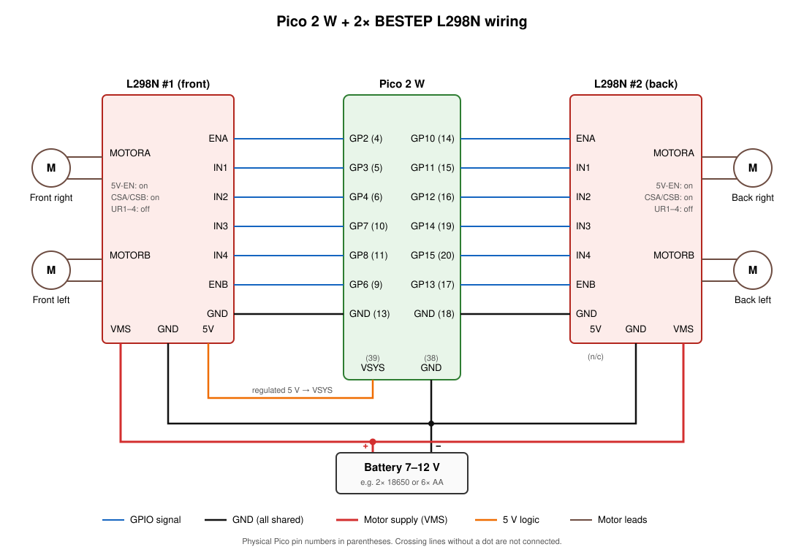
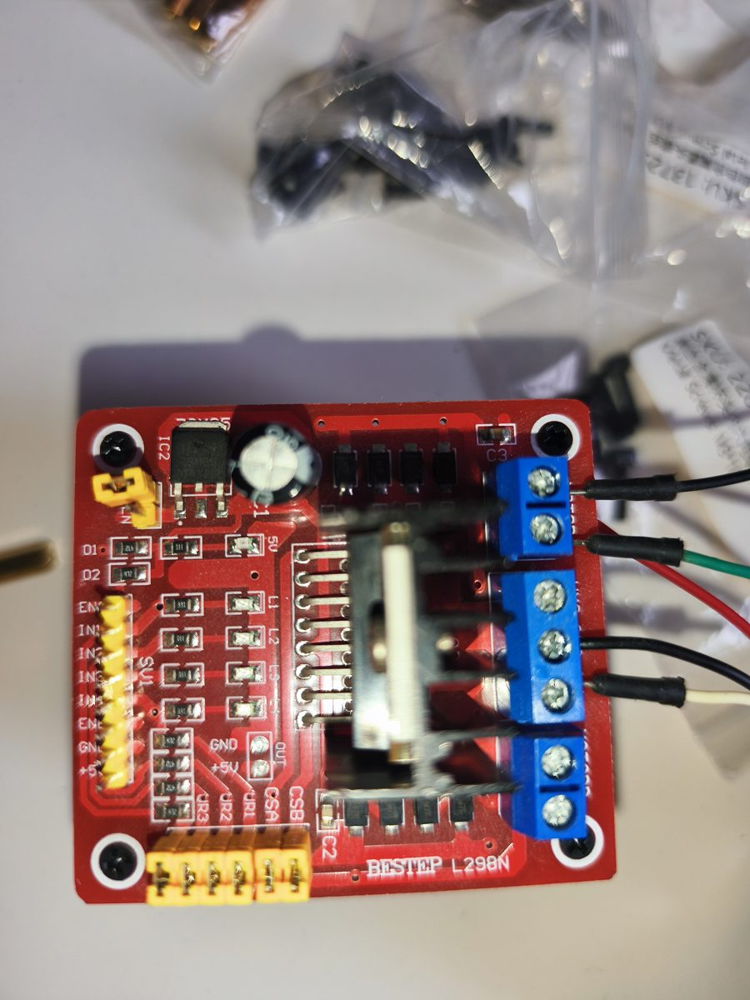
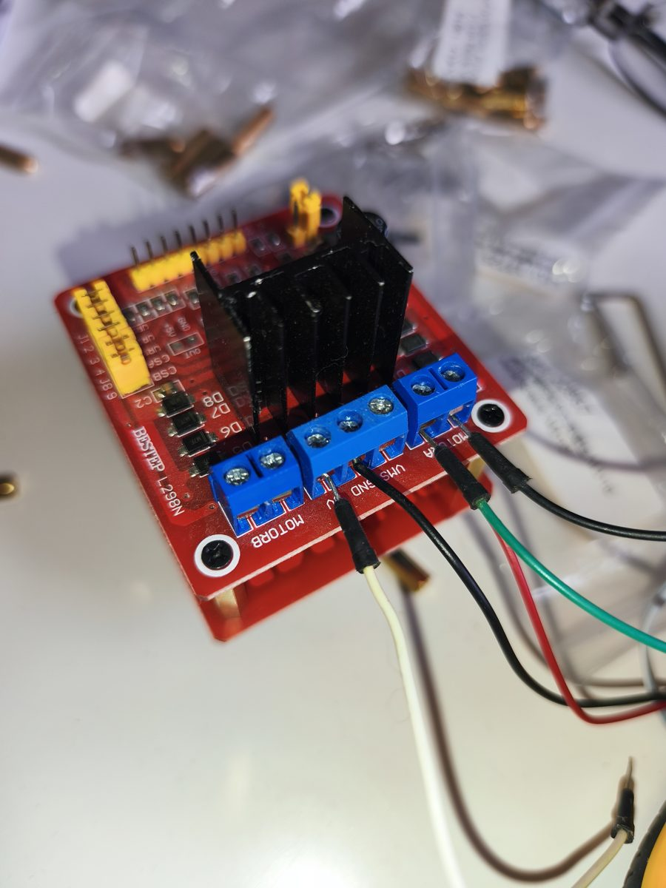

# pico2w_web_robot

Control a 4-wheel robot using an embedded web server running on a Raspberry Pi
Pico 2 W. The Pico either joins your home WiFi network or hosts its own (see
[WiFi modes](#wifi-modes)), serves a small control-panel web page, and drives
two L298N motor controllers (one per side pair of wheels) in response to
button presses (mouse, touch, or keyboard) from that page.

## Hardware

- Raspberry Pi Pico 2 W
- 2x L298N motor driver boards, one per axle pair:
  - Controller 1: front-left wheel + front-right wheel
  - Controller 2: back-left wheel + back-right wheel
- 4x DC gear motors (one per wheel)

### Wiring



The schematic shows the recommended battery setup (see [Power](#power)).

Pin numbers are Pico GPIO numbers (physical pin number in parentheses), defined
in [custom.h](custom.h):

| Wheel | ENA/B (PWM) | IN1 | IN2 |
| --- | --- | --- | --- |
| Front left | GP6 (9) | GP7 (10) | GP8 (11) |
| Front right | GP2 (4) | GP3 (5) | GP4 (6) |
| Back left | GP13 (17) | GP14 (19) | GP15 (20) |
| Back right | GP10 (14) | GP11 (15) | GP12 (16) |

Each ENA/ENB pin is driven with PWM for speed control; IN1/IN2 set direction.
See [this video](https://www.youtube.com/watch?v=dyjo_ggEtVU) for wiring an L298N.

#### BESTEP L298N boards

The instructions below are for the red BESTEP L298N board. Other L298N boards
work the same way, but their labels and jumpers may differ.




**Logic header** (`ENA IN1 IN2 IN3 IN4 ENB GND +5V`). Board 1 drives the front
wheels and board 2 the back wheels:

| L298N pin | Board 1 (front) | Board 2 (back) |
| --- | --- | --- |
| ENA | GP2 (4): front-right speed | GP10 (14): back-right speed |
| IN1 | GP3 (5) | GP11 (15) |
| IN2 | GP4 (6) | GP12 (16) |
| IN3 | GP7 (10) | GP14 (19) |
| IN4 | GP8 (11) | GP15 (20) |
| ENB | GP6 (9): front-left speed | GP13 (17): back-left speed |
| GND | Pico GND (e.g. 3, 8, 13) | Pico GND (e.g. 18, 23) |

Leave the header's `+5V` pin unconnected. Never wire it to the Pico's 3V3 pin.

**Screw terminals:**

- `MOTORA`: the right wheel of the pair. `MOTORB`: the left wheel.
- Motor leads: each motor cable has one **dotted** (marked) wire and one
  **plain** wire. On every motor terminal, put the dotted wire in the
  **outer** screw (at the board corner) and the plain wire in the **inner**
  screw (next to the power terminals).

  Why the same rule works on both sides: in "forward", the firmware drives
  every motor with the same polarity (IN1 high/IN2 low, IN3 high/IN4 low). The
  outputs are laid out `OUT1 OUT2 | power | OUT3 OUT4`, so "dotted wire on the
  outer screw" connects the left motors the opposite way round from the right
  motors. That matches how they're mounted as mirror images on the chassis.

- `VMS`: motor supply +. `GND`: supply − (shared with the Pico GND).
- `5V`: regulated 5 V **output** when the `5V-EN` jumper is fitted, or a 5 V
  logic **input** when it is removed (see [Power](#power)).

**Jumpers:**

- `5V-EN` (top left, next to the regulator): enables the onboard 5 V regulator.
  See [Power](#power) for when to fit it.
- `CSA` / `CSB`: keep them **fitted**. They connect the current-sense resistors
  to ground, and the motors won't run without them.
- `UR1`–`UR4`: **remove** them. They pull IN1–IN4 up to 5 V, which the Pico
  (3.3 V logic) doesn't need and which can feed 5 V into its GPIOs when the
  Pico is unpowered.

When testing for the first time, lift the robot so its wheels are off the
ground and hold **forward**:

- All four wheels roll backwards: your motors are marked the other way round,
  so swap dotted/plain on **all** motors.
- One side rolls backwards: swap dotted/plain on that side's two motors.
- A single wheel is wrong: swap just that motor's two wires.

### Power

**Every ground must be connected together:** the battery or power bank, both
L298N boards and the Pico.

**Recommended: a battery pack (7–12 V, e.g. 2× 18650 or 6× AA).** The Pico is
powered from the L298N's regulator:

```text
Battery +  ── Board 1 VMS ── Board 2 VMS
Battery −  ── Board 1 GND ── Board 2 GND ── Pico GND (pin 38)

Board 1  5V terminal (output) ── Pico VSYS (pin 39)
```

- Fit `5V-EN` on **both** boards, so each board powers its own logic.
- Take 5 V to the Pico from **one** board only, and never connect the two
  boards' `5V` terminals together.
- Above 12 V, remove `5V-EN` and supply 5 V to the logic separately.

**Alternative: a USB power bank (5 V).** This works, but the L298N drops about
2 V, so the motors only get about 3 V and run slowly. Also, 5 V is too low for
the onboard regulator, so feed 5 V in directly:

```text
Power bank +5V ──┬── Board 1 VMS + 5V terminal   (5V-EN removed)
                 ├── Board 2 VMS + 5V terminal   (5V-EN removed)
                 └── Pico VSYS (pin 39)
Power bank GND ──┬── Board 1 GND
                 ├── Board 2 GND
                 └── Pico GND (pin 38)
```

- Remove `5V-EN` on both boards, and put a short wire between `VMS` and `5V`
  on each board.
- Put a 470–1000 µF (≥10 V) capacitor across +5V/GND near the boards. Without
  it, the current burst when the motors start can reset the Pico.
- Use a power bank that can supply 2 A. Some power banks cut out when the load
  changes suddenly, so if the robot keeps shutting off, suspect the power bank.

Either way, it's safe to plug the Pico into a PC over USB for flashing or
serial output while it's powered through VSYS, because the Pico has a diode
between USB power and VSYS. Don't connect anything to the Pico's `3V3` (pin 36)
or `VBUS` (pin 40) pins.

`GP20` (physical pin 26) is reserved as `WIFI_MODE_SWITCH_PIN` for a future
physical WiFi-mode toggle switch — see [WiFi modes](#wifi-modes). It's optional
and unused if left unconnected.

## Prerequisites

- [Raspberry Pi Pico SDK](https://github.com/raspberrypi/pico-sdk) and ARM
  toolchain, most easily installed via the **Raspberry Pi Pico VS Code
  extension** (this repo's `.vscode/` config targets it), which manages CMake,
  Ninja, the toolchain, and `picotool` under `~/.pico-sdk`.
- A 2.4GHz WiFi network (the board connects in station mode).

## Setup

1. Copy the WiFi credentials template and fill in your network:

   ```bash
   cp wifi_config.cmake.example wifi_config.cmake
   ```

   Edit `wifi_config.cmake` and set `WIFI_SSID` / `WIFI_PASSWORD` (your home
   network) and, optionally, `WIFI_AP_SSID` / `WIFI_AP_PASSWORD` (the robot's
   own network — see [WiFi modes](#wifi-modes)). This file is gitignored —
   your credentials are never committed.
2. Open the project folder in VS Code with the Raspberry Pi Pico extension
   installed (it should auto-detect `CMakeLists.txt` and configure the build).

## WiFi modes

Which network the robot uses is decided at boot by reading
`WIFI_MODE_SWITCH_PIN` (`GP20`, see [Wiring](#wiring)):

- **Floating, or pulled high** (its default state via an internal pull-up —
  i.e. nothing wired to it) → **access-point mode**: the robot hosts its own
  network (`WIFI_AP_SSID` / `WIFI_AP_PASSWORD`, defaulting to `PicoRobot` /
  `robot1234` if unset) at the fixed address `192.168.4.1`, and hands out DHCP
  leases to anything that joins it. This is the default today, since no
  physical switch exists yet.
- **Pulled to GND** → **station mode**: joins the home network configured as
  `WIFI_SSID` / `WIFI_PASSWORD`.

This pin is deliberately wired into the firmware now even though no physical
switch is installed: once one is added (wired to short `GP20` to GND in one
position), no firmware changes will be needed — flip the switch and reboot.

In access-point mode there's no captive-portal/DNS redirect, so browse to
`192.168.4.1` manually after connecting; some phones may show a harmless "no
internet" warning since the network has no internet access.

Only one device can control the robot at a time. The bundled DHCP server
([dhcpserver/](dhcpserver/)) only ever hands out a single lease
(`DHCPS_MAX_IP` = 1), and [wifi_ap_filter.h](wifi_ap_filter.h) — via lwIP's
`LWIP_HOOK_IP4_INPUT` hook — enforces a "first client wins" lock: whichever
device's traffic is seen first becomes the sole allowed source IP, so a
second device (even one that manually sets itself a static IP) is dropped
before DHCP/TCP/UDP ever see its packets. The lock releases automatically
after `WIFI_AP_CLIENT_LOCK_TIMEOUT_MS` (1 second, `custom.h`) of silence from
the active client — e.g. its tab is closed or it locks — letting a different
device take over. This isn't a hard radio-level limit — a device could still
associate to the WiFi itself, and one that deliberately spoofs the active
client's exact IP would cause a conflict rather than being blocked — but it
stops the realistic case of a second phone/laptop silently joining and
fighting for control.

## Build & flash

Using the VS Code extension's tasks (Terminal > Run Task):

- **Compile Project** — builds with Ninja into `build/`
- **Run Project** — loads and runs the built firmware over USB via `picotool`
- **Flash** — programs the board over a CMSIS-DAP debug probe via OpenOCD

Or from a shell with the SDK/toolchain on `PATH`:

```bash
cmake -G Ninja -B build
ninja -C build
```

This produces `build/picow_httpd_background.uf2` (drag-and-drop onto the Pico
in BOOTSEL mode) along with `.elf`/`.hex`/`.bin` outputs.

Serial output is available over USB (`pico_enable_stdio_usb`) and logs WiFi
connection status, received commands, and vehicle speed — useful for
debugging without a debug probe attached.

## Usage

1. Power on the robot. Depending on `WIFI_MODE_SWITCH_PIN` (see
   [WiFi modes](#wifi-modes)), it either joins your home WiFi network or starts
   hosting its own, then starts an HTTP server on port 80. Watch the USB
   serial output for the IP to use — the assigned address in station mode, or
   `192.168.4.1` in access-point mode.
2. Open that IP address in a browser (desktop or mobile, connected to the same
   network) to load the control panel.
3. Press and hold a direction button (or focus it and hold Space/Enter) to
   drive; release to stop. Holding a button repeats the command roughly every
   300ms, which ramps the vehicle's speed up the longer it's held; releasing
   ramps it back down. "STOP NOW" halts the motors immediately.

### Controls

| | | |
| --- | --- | --- |
| Front Left | Go Front | Front Right |
| Left | **STOP NOW** | Right |
| Back Left | Go Back | Back Right |

- **Go Front / Go Back**: all four wheels drive together.
- **Left / Right**: wheels on one side drive forward, the other side reverses,
  pivoting the robot in place.
- **Diagonal buttons** (Front Left, Front Right, Back Left, Back Right): one
  side drives at full speed and the other at half speed, arcing the robot
  toward the slower side while still moving forward/backward.

### Safety

If the robot stops receiving commands for about a second (WiFi drops, the
browser tab closes, etc.) while still moving, it automatically stops the
motors rather than continuing to drive indefinitely.

## Project structure

- [pico_httpd.c](pico_httpd.c) — WiFi bring-up (station or access-point mode),
  PWM/motor control, the `/control.cgi` command handler, and the
  speed/direction state machine.
- [custom.h](custom.h) — motor and WiFi-mode-switch GPIO pin mappings and lwIP
  httpd feature flags, force-included into every compile unit.
- [lwipopts.h](lwipopts.h) — lwIP network stack configuration.
- [dhcpserver/](dhcpserver/) — vendored DHCP server (MIT-licensed, from
  `pico-examples`) that hands out leases to clients in access-point mode.
- [wifi_ap_filter.h](wifi_ap_filter.h) — lwIP `LWIP_HOOK_IP4_INPUT` hook
  (wired in via `lwipopts.h`) restricting access-point traffic to the single
  DHCP-leased client.
- [content/](content/) — the static web control panel (`index.html`) served
  by the Pico, baked into the firmware image at build time.
- [wifi_config.cmake.example](wifi_config.cmake.example) — template for your
  local, gitignored `wifi_config.cmake`.

See [CLAUDE.md](CLAUDE.md) for a deeper architecture walkthrough.
